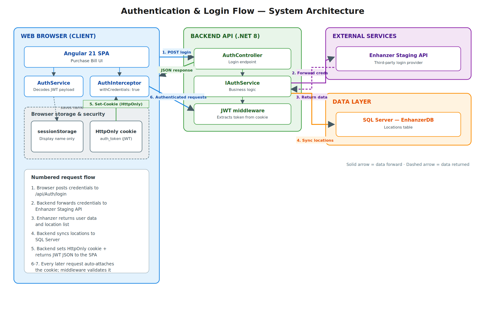

# 🏗️ PurchaseBillAPI — .NET 8 Web API

A secure, production-grade **ASP.NET Core 8 Web API** that serves as the backend for the Enhanzer Purchase Bill System. It handles user authentication via a third-party external API, generates and manages JWT sessions using HttpOnly cookies, and provides location data persistence through SQL Server.

---

## 📐 System Architecture



---

## ✨ Key Features

| Feature | Description |
|---|---|
| **Third-Party Authentication** | Forwards login credentials to the [Enhanzer Staging API](https://ez-staging-api.azurewebsites.net) for external validation. |
| **JWT Generation** | Issues signed JWTs with custom claims (`User_Code`, `User_Display_Name`) upon successful authentication. |
| **HttpOnly Cookie Sessions** | Attaches the JWT to a secure, HttpOnly cookie (`auth_token`) to mitigate XSS token theft. |
| **Location Sync** | Extracts `User_Locations` from the third-party response and syncs them to a local SQL Server database. |
| **Secure Secret Management** | Database credentials and the JWT signing key are stored using `dotnet user-secrets`, keeping them out of source control. |

---

## 🛠️ Tech Stack

- **Runtime:** .NET 8
- **Framework:** ASP.NET Core Web API
- **ORM:** Entity Framework Core 8 (SQL Server Provider)
- **Authentication:** JWT Bearer (`System.IdentityModel.Tokens.Jwt`)
- **API Documentation:** Swagger / Swashbuckle
- **Secret Management:** .NET User Secrets

---

## 📁 Project Structure

```
PurchaseBillAPI/
├── Controllers/
│   ├── AuthController.cs          # Login endpoint, sets HttpOnly cookie
│   └── LocationsController.cs     # GET endpoint for synced locations
├── DTOs/
│   └── LoginDto.cs                # Login request data transfer object
├── Data/
│   └── AppDbContext.cs            # EF Core database context
├── Migrations/                    # EF Core auto-generated migrations
├── Models/
│   └── LocationDetail.cs          # Location entity model
├── Services/
│   ├── IAuthService.cs            # Auth service interface
│   ├── AuthService.cs             # Auth logic, JWT generation, location sync
│   ├── ILocationService.cs        # Location service interface
│   └── LocationService.cs         # Location data retrieval
├── Properties/
│   └── launchSettings.json        # Development launch profiles
├── Program.cs                     # App entry point, DI, middleware pipeline
├── appsettings.json               # Non-sensitive configuration
└── PurchaseBillAPI.csproj         # Project file & NuGet dependencies
```

---

## 🚀 Getting Started

### Prerequisites

- [.NET 8 SDK](https://dotnet.microsoft.com/download/dotnet/8.0)
- [SQL Server](https://www.microsoft.com/en-us/sql-server) (local or Docker)

### 1. Clone the Repository

```bash
git clone <repository-url>
cd PurchaseBillAPI
```

### 2. Configure User Secrets

Sensitive credentials are managed via **dotnet user-secrets** and are never committed to source control.

```bash
# Initialize the secret store (already done if UserSecretsId exists in .csproj)
dotnet user-secrets init

# Set the database connection string
dotnet user-secrets set "ConnectionStrings:DefaultConnection" \
  "Server=localhost,1433;Database=EnhanzerDB;User Id=sa;Password=<YOUR_PASSWORD>;TrustServerCertificate=True;"

# Set the JWT signing key (must be at least 32 characters)
dotnet user-secrets set "JwtSettings:SecretKey" \
  "<YOUR_SECRET_KEY_AT_LEAST_32_CHARS>"
```

### 3. Apply Database Migrations

```bash
dotnet ef database update
```

### 4. Run the API

```bash
dotnet run
```

The API will start on `http://localhost:5020` (or as configured in `launchSettings.json`).

Swagger UI is available at: `http://localhost:5020/swagger`

---

## 🔌 API Endpoints

### Authentication

| Method | Endpoint | Description | Auth Required |
|--------|----------|-------------|:---:|
| `POST` | `/api/Auth/login` | Authenticate user, return JWT & set HttpOnly cookie | ❌ |

**Request Body:**
```json
{
  "username": "info@enhanzer.com",
  "password": "your_password"
}
```

**Response:**
```json
{
  "message": "Login successful",
  "token": "eyJhbGciOiJIUzI1NiIs..."
}
```

**Response Headers:**
```
Set-Cookie: auth_token=eyJhbGci...; path=/; httponly; samesite=lax
```

### Locations

| Method | Endpoint | Description | Auth Required |
|--------|----------|-------------|:---:|
| `GET` | `/api/Locations` | Retrieve all synced locations | ✅ |

**Response:**
```json
[
  {
    "Location_Code": "LOC001",
    "Location_Name": "Main Warehouse"
  }
]
```

---

## 🔐 Security Architecture

### Authentication Flow

1. **Client** sends `POST /api/Auth/login` with credentials.
2. **AuthService** forwards the credentials to the external Enhanzer Staging API.
3. The external API validates and returns user data + location details.
4. **AuthService** syncs locations to the local SQL Server database.
5. **AuthService** generates a signed JWT containing custom claims.
6. **AuthController** attaches the JWT to an **HttpOnly cookie** (`auth_token`) and returns the token in the JSON body.
7. For subsequent requests, the browser automatically sends the cookie; the **JWT middleware** extracts and validates it.

### JWT Claims

| Claim | Description | Example |
|-------|-------------|---------|
| `sub` | Subject (username/email) | `info@enhanzer.com` |
| `email` | User email | `info@enhanzer.com` |
| `jti` | Unique token identifier | `d402b2bd-6312-...` |
| `User_Code` | Internal user code | `EZCMP1/EZUSR-1` |
| `User_Display_Name` | Display name for UI | `eZuite Admin` |
| `exp` | Expiry timestamp | Unix timestamp |

### Cookie Configuration

| Property | Value | Purpose |
|----------|-------|---------|
| `HttpOnly` | `true` | Prevents JavaScript access (XSS protection) |
| `Secure` | `false` (dev) / `true` (prod) | HTTPS-only in production |
| `SameSite` | `Lax` | CSRF protection |
| `Expires` | 60 minutes | Matches JWT expiry |

### CORS Policy

The CORS policy is configured to explicitly allow the Angular frontend origin and support credentials:

```csharp
app.UseCors(policy => policy
    .WithOrigins("http://localhost:4200")
    .AllowCredentials()
    .AllowAnyMethod()
    .AllowAnyHeader());
```

---

## ⚙️ Configuration Reference

### `appsettings.json` (Non-Sensitive)

```json
{
  "JwtSettings": {
    "Issuer": "EnhanzerAPI",
    "Audience": "EnhanzerApp",
    "ExpiryInMinutes": 60
  }
}
```

### User Secrets (Sensitive — Not in Source Control)

| Key | Description |
|-----|-------------|
| `ConnectionStrings:DefaultConnection` | SQL Server connection string |
| `JwtSettings:SecretKey` | HMAC-SHA256 signing key for JWT tokens |

---

## 📄 License

This project is developed as part of the Enhanzer software engineering assessment.
